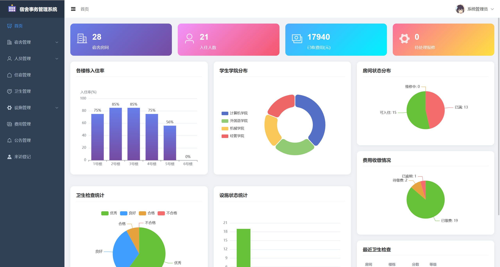
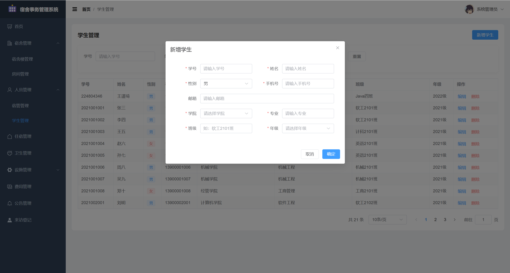
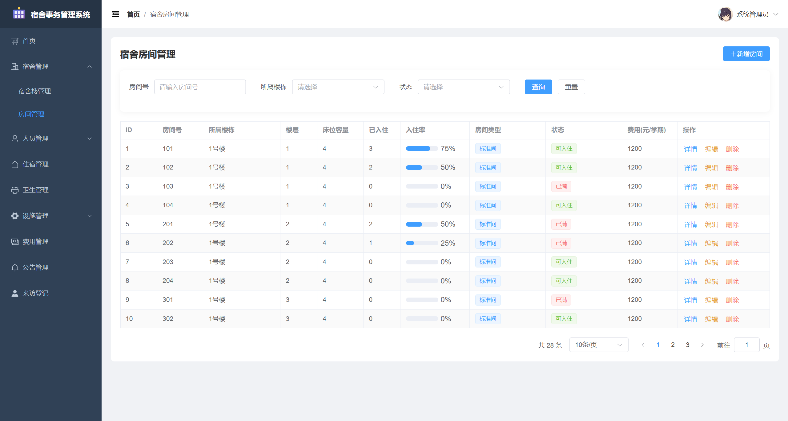
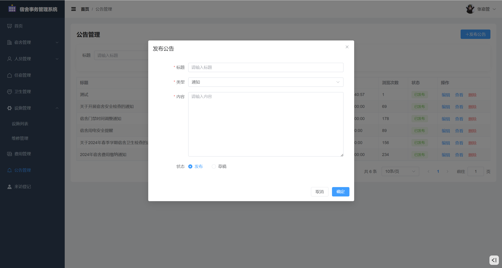
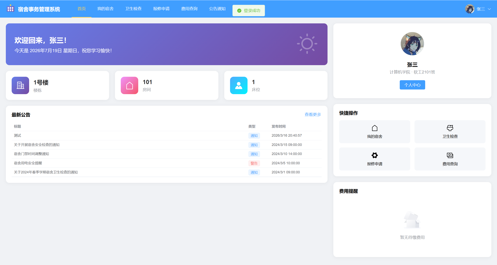
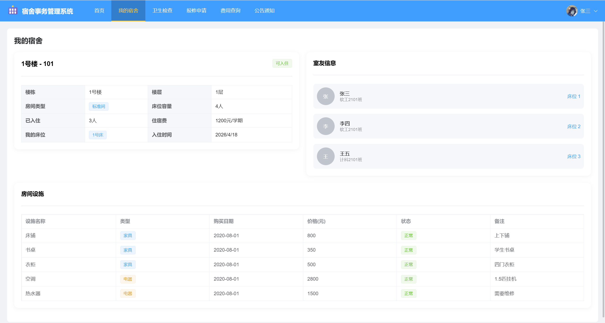
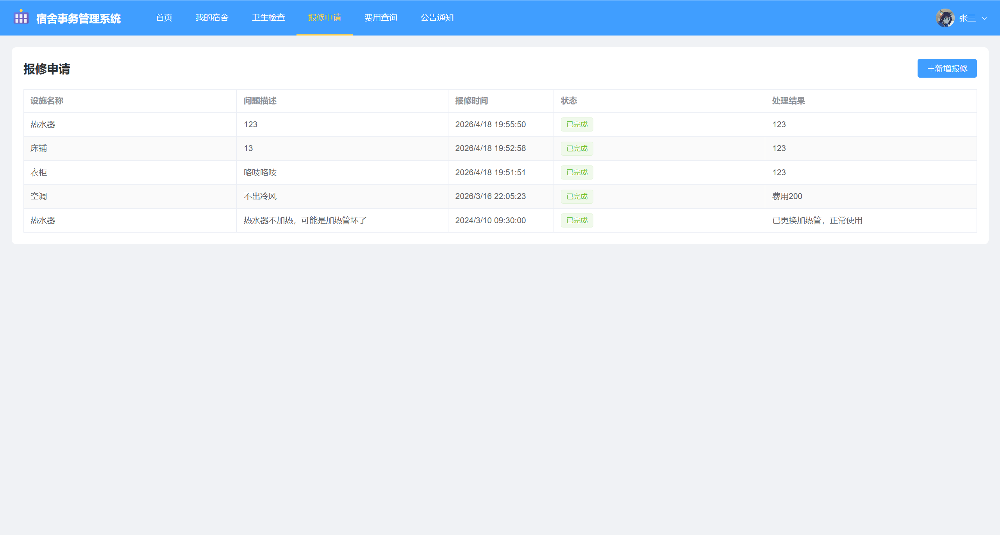
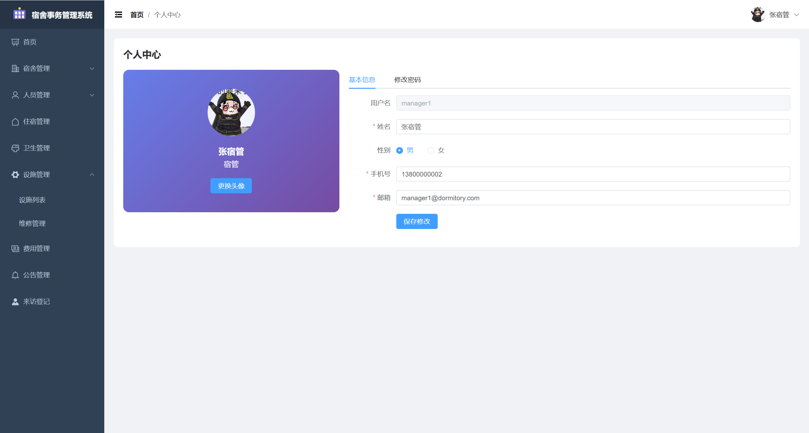

# 宿舍事务管理系统

> 基于 Spring Boot + Vue 3 的智慧宿舍综合管理平台 — Student Dormitory Management System (SDMS)

## 📋 项目简介

**宿舍事务管理系统** 是一套面向高校学生宿舍的数字化管理解决方案，覆盖宿舍日常管理的核心事务。系统采用前后端分离架构，提供管理员、宿管、学生三种角色门户，实现从宿舍资源分配到日常运营的全流程闭环管理。

系统围绕宿舍生活的各项**事务**展开——从学生入住、卫生检查、设施报修，到费用缴纳、来访登记、公告通知，全方位数字化管理宿舍生态。

---

## 🖥️ 技术栈

### 后端

| 技术 | 版本 |
|------|------|
| Spring Boot | 2.7.18 |
| JDK | 1.8 |
| Maven | 3.x |
| MyBatis-Plus | 3.5.3.1 |
| MySQL | 8.x |
| JJWT | 0.9.1 |
| Lombok | - |

### 前端

| 技术 | 版本 |
|------|------|
| Vue | 3.3.4 |
| Vite | 4.4.9 |
| Element Plus | 2.4.1 |
| Pinia | 2.1.7 |
| Vue Router | 4.2.5 |
| Axios | 1.5.1 |
| ECharts | 5.4.3 |

---

## ✨ 功能模块

### 🔐 系统管理
- **用户登录 / 注册** — 支持管理员、宿管、学生三种角色登录
- **密码管理** — 修改密码、忘记密码重置
- **个人中心** — 查看/编辑个人信息、更换头像

### 📊 首页仪表盘
- 宿舍房间数、入住人数统计
- 费用缴纳情况概览（已收金额、未缴笔数）
- 待处理维修工单数
- 当日来访人数
- 各宿舍楼住宿分布图、学院人数分布图、年级分布图
- 卫生评分趋势、设施状态统计

### 🏢 宿舍楼管理
- 宿舍楼的新增、编辑、删除、查询
- 设置楼栋类型（男生楼/女生楼）、楼层数、每层房间数
- 分配宿管人员到对应楼栋
- 各楼栋住宿统计数据

### 🚪 宿舍房间管理
- 房间的新增、编辑、删除、查询
- 管理房间容量、当前入住人数
- 房间类型（标准间/优越间）与住宿费设置
- 房间状态管理（可入住/已满/维修中）

### 🎓 学生管理
- 学生信息的增删改查
- 关联系统用户账号
- 管理学院、专业、班级、年级等学籍信息

### 🛏️ 住宿管理
- **学生入住** — 分配宿舍房间、床位号，记录入住时间
- **学生退宿** — 办理退宿手续
- 支持按楼栋、楼层、房间筛选查看住宿情况

### 🧹 卫生管理
- 宿舍卫生检查评分（0-100分）
- 自动评定等级（优秀/良好/合格/不合格）
- 检查记录追溯与历史趋势查看
- 学生端可查看本宿舍卫生评分

### 🔧 设施管理
- 宿舍设施（床铺、书桌、衣柜、空调等）的登记管理
- 设施状态跟踪（正常/损坏/维修中/已报废）
- 按房间查看设施清单

### 🔨 维修管理
- **学生报修** — 提交设施故障描述
- **维修处理** — 宿管分配维修、记录处理结果与费用
- 维修状态跟踪（待处理/处理中/已完成/已拒绝）
- 维修记录历史查询

### 💰 费用管理
- **费用类型** — 住宿费、水电费、网费、空调费、押金等
- **费用记录** — 学生费用缴纳记录
- 支付状态管理（未支付/已支付/已逾期）
- 按学年、学期筛选
- 支持微信、支付宝、银行卡、现金等多种支付方式
- 学生端在线查询个人费用

### 📢 公告管理
- 通知/公告/警告三类消息发布
- 发布人、发布时间、浏览次数记录
- 支持草稿与发布状态管理
- 学生端查看公告通知

### 📝 来访登记
- 来访人员信息登记（姓名、电话、身份证号）
- 关联访问楼栋、房间、被访学生
- 来访状态管理（访问中/已离开）
- 登记人追溯

---

## 👥 角色权限

| 角色 | 职责范围 |
|------|---------|
| **管理员 (admin)** | 系统全功能访问，包括宿管管理、系统配置 |
| **宿管 (manager)** | 楼栋日常管理、卫生检查、维修处理、来访登记 |
| **学生 (student)** | 查看个人宿舍信息、报修、查费、查卫生成绩、看公告 |

---

## 📁 项目结构

```
DormitoryManagementSystem
├── backend                          # 后端项目 (Spring Boot)
│   ├── pom.xml                      # Maven 依赖配置
│   ├── src/main/java/com/dormitory
│   │   ├── common/                  # 通用工具类 (Result, PageResult)
│   │   ├── config/                  # 配置类 (MyBatisPlus, Web)
│   │   ├── controller/              # 控制器层
│   │   ├── dto/                     # 数据传输对象
│   │   ├── entity/                  # 实体类
│   │   ├── mapper/                  # MyBatis Mapper 接口
│   │   ├── service/                 # 业务逻辑层
│   │   └── exception/               # 异常处理
│   └── src/main/resources
│       ├── application.yml          # 应用配置
│       └── dormitory_db.sql         # 数据库初始化脚本
│
├── frontend                         # 前端项目 (Vue 3)
│   ├── package.json                 # Node 依赖配置
│   ├── vite.config.js               # Vite 构建配置
│   ├── index.html                   # 入口页面
│   └── src
│       ├── api/                     # API 接口封装
│       ├── layouts/                 # 布局组件
│       ├── router/                  # 路由配置
│       ├── stores/                  # Pinia 状态管理
│       ├── utils/                   # 工具函数
│       ├── styles/                  # 全局样式
│       └── views/                   # 页面视图
│           ├── admin/               # 管理端页面
│           └── student/             # 学生端页面
│
└── README.md                        # 项目说明文档
```

---

## 📸 项目截图

### 管理端









### 学生端







### 通用



---

## 🚀 快速开始

### 环境要求

- JDK 1.8+
- Maven 3.x
- MySQL 8.x
- Node.js 16+
- npm / pnpm

### 1. 数据库初始化

```bash
# 登录 MySQL 并执行初始化脚本
mysql -u root -p < backend/src/main/resources/dormitory_db.sql
```

### 2. 配置数据库连接

编辑 `backend/src/main/resources/application.yml`，修改数据库连接信息：

```yaml
spring:
  datasource:
    url: jdbc:mysql://localhost:3306/dormitory_db?useUnicode=true&characterEncoding=utf-8&useSSL=false&serverTimezone=Asia/Shanghai
    username: root
    password: your_password
```

### 3. 启动后端

**方式一：IDEA 运行**

在 IntelliJ IDEA 中打开 `backend` 目录，直接运行主启动类 `DormitoryApplication.java` 即可。

**方式二：命令行运行**

```bash
cd backend
mvn spring-boot:run
```

后端服务默认启动在 `http://localhost:8000/api`

### 4. 启动前端

```bash
cd frontend
npm install
npm run dev
```

前端服务默认启动在 `http://localhost:9000`

---

## 🔑 默认账号

| 角色 | 用户名 | 密码 |
|------|--------|------|
| 系统管理员 | `admin` | `123456` |
| 宿管 | `manager1` | `123456` |
| 学生 | `2021001001` | `123456` |

---

## 📄 数据库表结构

| 表名 | 说明 |
|------|------|
| `sys_user` | 系统用户表（管理员/宿管/学生） |
| `building` | 宿舍楼表 |
| `room` | 宿舍房间表 |
| `student_info` | 学生详细信息表 |
| `hygiene` | 宿舍卫生检查表 |
| `facility` | 设施表 |
| `facility_repair` | 设施维修记录表 |
| `fee_type` | 费用类型表 |
| `fee_record` | 费用记录表 |
| `notice` | 公告通知表 |
| `visitor` | 来访登记表 |

---

## 📜 开源协议

[MIT](LICENSE)

## ⚠️ 免责声明

本项目仅作为学习参考和技术交流使用。项目中包含的测试数据（如学生姓名、学号、联系方式等）均为虚构，如有雷同，纯属巧合。